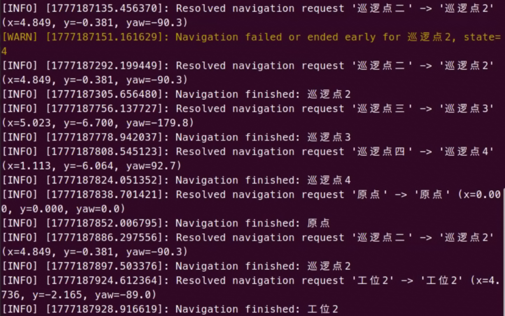
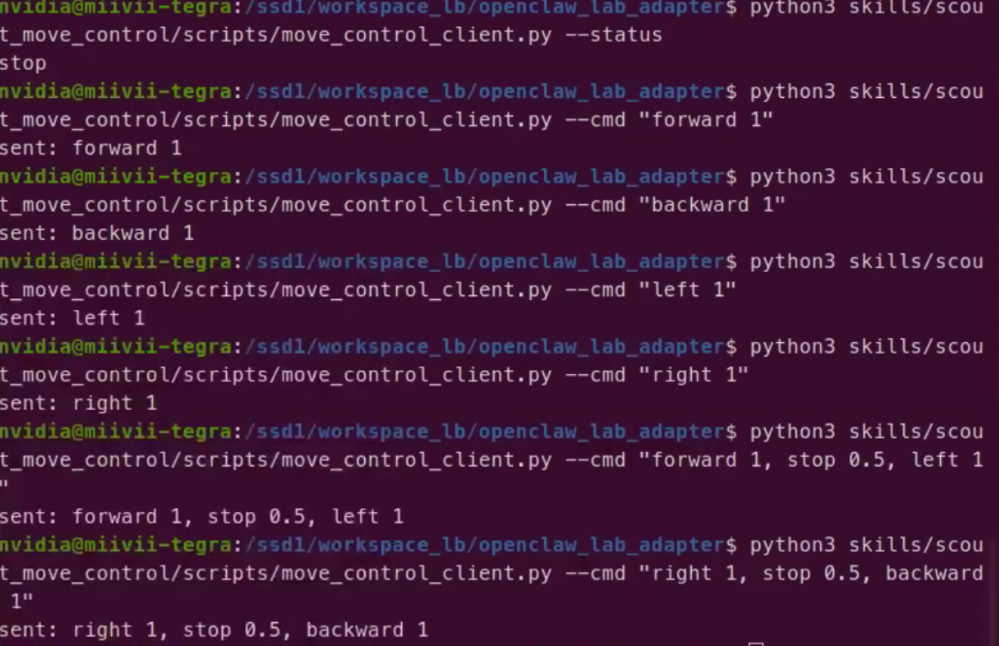

# 调试启动

本文用于调试 `openclaw_lab_adapter` 中基于 `sailors_onboard-main` 的 Scout 导航适配层，重点验证这条链路是否打通：

```text
自然语言/地点名 -> scout_navigation_manager -> YAML 坐标映射 -> move_base -> 1201 地图导航
```

默认基准地图：

```text
sailors_onboard-main/sailors_onboard-main/ros1_ws/vendor/control/scout_control/scout_launch/maps/1201.yaml
```

scp -r "D:\Program Files\科研材料\无人车\openclaw_lab_adapter" nvidia@192.168.3.47:/ssd1/workspace_lb/
scp -r "D:\Program Files\科研材料\无人车\openclaw_lab_adapter\*" nvidia@192.168.3.47:/ssd1/workspace_lb/openclaw_lab_adapter/

## 1. 调试前提

开始前建议确认：

- 无人车底盘已上电
- 激光、IMU、里程计等导航相关传感器已启动
- ROS1 环境可以正常 `source`
- `1201` 地图是当前实际运行的地图
- 机器人在 RViz 中已有稳定定位，不是飘的

如果底层 `move_base` / `amcl` / `map_server` 没有正常运行，适配服务本身无法完成导航，只能做到“接口起来但不执行”。

## 2. 推荐启动顺序

推荐按下面顺序启动，每一步都先确认再进入下一步。

### 2.1 进入小车项目目录并加载 ROS1 环境

```bash
cd /ssd1/workspace/openclaw_lab_adapter
source /opt/ros/noetic/setup.bash
```

预期：

- 没有报错
- 执行 `rosnode list`、`rostopic list` 等 ROS 指令时不会提示找不到命令

### 2.2 启动底层驱动与传感器

```bash
bash 1startup.bash
```

预期：

- 终端持续输出各驱动节点日志
- 不应持续刷屏 `cannot open serial`、`device not found`、`TF extrapolation` 之类硬错误

可以额外检查：

```bash
rostopic list | grep -E "/scan|/imu|/odom|/cmd_vel"
```

预期输出示例：

```text
/scan
/imu
/odom
/cmd_vel
```

### 2.3 启动地图、定位与导航

另开一个终端，进入同一目录并加载 ROS1 环境：

```bash
cd /ssd1/workspace/openclaw_lab_adapter
source /opt/ros/noetic/setup.bash
bash 2nav.bash
```

这个脚本会启动地图、定位与导航相关节点，通常包括：

- `map_server`
- `amcl`
- `move_base`

可以检查：

```bash
rosnode list | grep -E "map_server|amcl|move_base"
```

预期输出示例：

```text
/amcl
/map_server
/move_base
```

再检查 `move_base` action 是否在线：

```bash
rostopic list | grep move_base
```

预期输出示例：

```text
/move_base/goal
/move_base/status
/move_base/result
/move_base/feedback
```

## 3. 启动适配服务

另开一个终端，进入项目目录：

```bash
cd /ssd1/workspace/openclaw_lab_adapter
source /opt/ros/noetic/setup.bash
```

启动导航适配服务：

```bash
python3 skills/scout_navigation_manager/scripts/navigation_manager_server.py \
  --waypoints skills/scout_navigation_manager/config/navigation_position.yaml
```

导航服务预期日志示例：

```text
Waiting for /move_base action server...
Scout navigation manager started with 5 waypoint(s), map_id=1201, frame_id=map
```

说明：

- 如果调试的是“去原点 / 带我去前台 / 去实验台”这类地点导航，只需要启动 `scout_navigation_manager`。它会把地点名解析成坐标，再下发给 ROS1 `/move_base`。
- 如果调试的是“前进 / 后退 / 左转 / 右转 / 停止”这类底盘直接移动，需要另开终端启动 `scout_move_control`。它订阅 `/scout_move_control/chassis_command`，并向 ROS1 `/cmd_vel` 发布速度。

底盘直接移动调试服务启动方式：

```bash
cd /ssd1/workspace/openclaw_lab_adapter
source /opt/ros/noetic/setup.bash
python3 skills/scout_move_control/scripts/move_control_server.py
```

预期日志示例：

```text
Scout move control server started
```


如果卡在：

```text
Waiting for /move_base action server...
```

说明 `move_base` 还没起来，或者当前终端没有正确 `source` ROS1 环境。

## 4. 检查 YAML 与地点映射

当前映射文件：

```text
skills/scout_navigation_manager/config/navigation_position.yaml
```

先做静态检查：

```bash
python3 -m py_compile skills/scout_navigation_manager/scripts/navigation_manager_server.py \
  skills/scout_navigation_manager/scripts/navigate.py
```

预期：

- 没有输出
- 没有报错就是通过

再检查 YAML 能否正常解析：如果更换了点位一定要进行查看是否正确加载

```bash
python3 - <<'PY'
import yaml, pprint
with open("skills/scout_navigation_manager/config/navigation_position.yaml", "r", encoding="utf-8") as f:
    data = yaml.safe_load(f)
pprint.pprint(data["navigation_positions"])
PY
```

预期：

- 能打印出 `原点`、`接待区`、`实验台` 等点位
- 每个点位下都有 `x/y/yaw`
- 有些点位带有 `aliases`

## 5. 检查适配服务接口

方式 A：用客户端脚本 navigate.py

python3 skills/scout_navigation_manager/scripts/navigate.py --go 原点
python3 skills/scout_navigation_manager/scripts/navigate.py --go "带我去前台"

这本质上就是“手动代替智能体发请求”。

方式 B：直接调 ROS service
### 5.1 查询导航模式

```bash
rosservice call /scout_navigation_manager/get_navigation_mode
```
rosservice call /scout_navigation_manager/set_pose "data: '原点'"
rosservice call /scout_navigation_manager/set_pose "data: '带我去前台'"


预期输出示例：

```text
success: True
message: "named_waypoints"
```

### 5.2 查询地点列表

```bash
rosservice call /scout_navigation_manager/list_positions
```

预期输出示例：

```text
success: True
message: "原点,实验台,接待区,物料区,巡检点A"
```

### 5.3 查询导航状态

```bash
rosservice call /scout_navigation_manager/navigation_status
```

初始预期输出：

```text
success: True
message: "ready"
```

## 6. 测试自然语言到地点名映射

先用客户端脚本做轻量测试：

```bash
python3 skills/scout_navigation_manager/scripts/navigate.py --go 原点
python3 skills/scout_navigation_manager/scripts/navigate.py --go 巡逻点二
python3 skills/scout_navigation_manager/scripts/navigate.py --go "巡逻点三"
python3 skills/scout_navigation_manager/scripts/navigate.py --go "巡逻点四"
python3 skills/scout_navigation_manager/scripts/navigate.py --go "工位2"
```

预期输出示例：

```text
success=True resolved=原点 message=true
success=True resolved=原点 message=true
success=True resolved=接待区 message=true
success=True resolved=实验台 message=true
```

如果输入一个不存在的地点：

```bash
python3 skills/scout_navigation_manager/scripts/navigate.py --go "去火星基地"
```

预期输出示例：

```text
unknown waypoint: 去火星基地
available: 原点,实验台,接待区,物料区,巡检点A
```

同时观察服务端终端，预期能看到类似日志：

```text
Resolved navigation request '带我去前台' -> '接待区' (x=1.200, y=-0.800, yaw=0.0)
```

底盘直接移动调试命令：

```bash
python3 skills/scout_move_control/scripts/move_control_client.py --status
python3 skills/scout_move_control/scripts/move_control_client.py --cmd "forward 1"
python3 skills/scout_move_control/scripts/move_control_client.py --cmd "backward 1"
python3 skills/scout_move_control/scripts/move_control_client.py --cmd "left 1"
python3 skills/scout_move_control/scripts/move_control_client.py --cmd "right 1"
python3 skills/scout_move_control/scripts/move_control_client.py --cmd "stop 0.5"
```

也可以组合动作：

```bash
python3 skills/scout_move_control/scripts/move_control_client.py --cmd "forward 1, stop 0.5, left 1"
python3 skills/scout_move_control/scripts/move_control_client.py --cmd "right 1, stop 0.5, backward 1"
```

建议先短时间、小速度验证，确认周围安全后再扩大动作时间。`move_control_server.py` 当前默认速度为线速度 `0.20 m/s`、角速度 `0.60 rad/s`。
 针对这个skills的测试成功，能够进行细微小范围的移动


## 7. 测试真实导航

### 7.1 通过服务发送目标

```bash
rosservice call /scout_navigation_manager/set_pose "data: '原点'"
```

预期输出示例：

```text
success: True
message: "true"
```

随后检查状态：

```bash
rosservice call /scout_navigation_manager/navigation_status
```

预期可能经历两个阶段：

```text
success: True
message: "moving to 原点"
```

到达后：

```text
success: True
message: "finish"
```

### 7.2 通过自然语言短句发送目标

```bash
rosservice call /scout_navigation_manager/set_pose "data: '带我去前台'"
```

预期：

- 服务调用返回成功
- 适配服务日志解析到 `接待区`
- RViz 中目标点落在 `接待区` 坐标附近
- 机器人开始规划并移动

### 7.3 RViz 中确认是否真的到对位置

重点看：

- 目标点是否落在可通行区域
- 全局路径是否生成
- 机器人是否沿路径前进
- 到达后 `navigation_status` 是否变为 `finish`

如果服务成功、状态也变了，但车不动，通常问题不在适配层，而在：

- `move_base` 规划失败
- AMCL 定位不稳定
- 点位落在障碍物/墙内
- 底盘控制链路未接通

## 8. 如何校准 1201 地图上的真实点位

建议用 RViz 做标定：

1. 在小车上进入 `/ssd1/workspace/openclaw_lab_adapter`，执行 `source /opt/ros/noetic/setup.bash`
2. 启动 `bash 1startup.bash`
3. 另开终端执行 `source /opt/ros/noetic/setup.bash` 后启动 `bash 2nav.bash`
4. 在 RViz 中使用 `2D Nav Goal`
5. 选中你想定义成“前台/实验台/仓库”的真实位置
6. 记录目标的 `x / y / yaw`
7. 写回 `navigation_position.yaml`

配置格式示例：

```yaml
  样品区:
    x: 1.85
    y: -2.10
    yaw: 90.0
    description: "1201 地图中的样品区"
    aliases:
      - 样品台
      - 去样品区
      - 带我去样品台
```

改完 YAML 后，重启 `navigation_manager_server.py` 再测试。

## 9. 常见问题与排查

### 9.1 服务起不来

现象：

```text
ImportError: No module named rospy
```

原因：

- 当前终端没执行 `source /opt/ros/noetic/setup.bash`

### 9.2 服务一直卡在等待 move_base

现象：

```text
Waiting for /move_base action server...
```

原因：

- `bash 2nav.bash` 没启动
- `move_base` 节点挂了
- ROS master 不一致

排查：

```bash
rosnode list | grep move_base
```

### 9.3 输入地点后提示找不到

现象：

```text
can't find the navigation goal: 带我去前台
```

原因：

- YAML 中没有对应 `aliases`
- 文本归一化后仍未命中任何地点

排查：

- 检查 `navigation_position.yaml`
- 先用标准地点名测试，再加别名测试

### 9.4 服务返回成功，但车没动

原因通常是底层导航问题，不是适配层问题：

- 点位在障碍物内
- AMCL 飘了
- 局部规划失败
- 底盘驱动未接收 `/cmd_vel`

建议检查：

```bash
rostopic echo /move_base/status
rostopic echo /cmd_vel
```

如果 `/move_base/status` 有反馈但 `/cmd_vel` 没输出，重点查导航规划参数。

## 10. 推荐最小闭环

如果只想最快确认“适配层已经工作”，建议最少做下面这组：

1. `cd /ssd1/workspace/openclaw_lab_adapter && source /opt/ros/noetic/setup.bash`
2. `bash 1startup.bash`
3. 另开终端执行 `cd /ssd1/workspace/openclaw_lab_adapter && source /opt/ros/noetic/setup.bash`
4. `bash 2nav.bash`
5. 再另开终端执行 `cd /ssd1/workspace/openclaw_lab_adapter && source /opt/ros/noetic/setup.bash`
6. 启动 `navigation_manager_server.py`
7. `rosservice call /scout_navigation_manager/list_positions`
8. `python3 skills/scout_navigation_manager/scripts/navigate.py --go "带我去前台"`
9. 看服务端是否打印 `Resolved navigation request ... -> 接待区`
10. 看 RViz 和车体是否朝对应点位移动

只要这组闭环能跑通，就说明“自然语言/地点名 -> YAML 映射 -> move_base 导航”这条链路已经接通。
