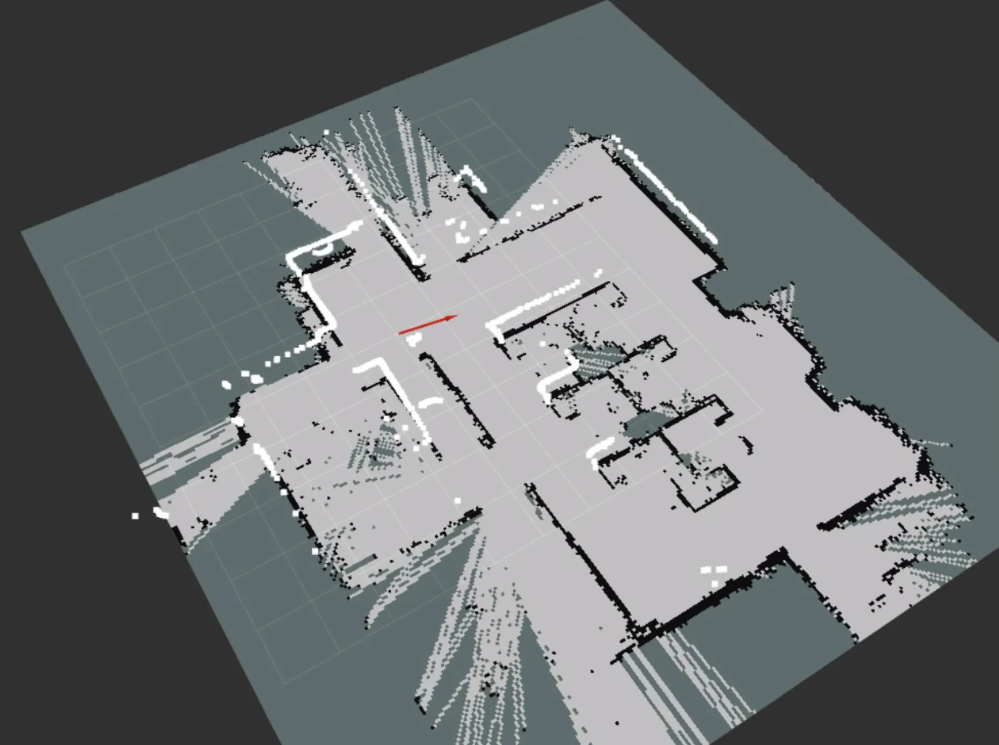
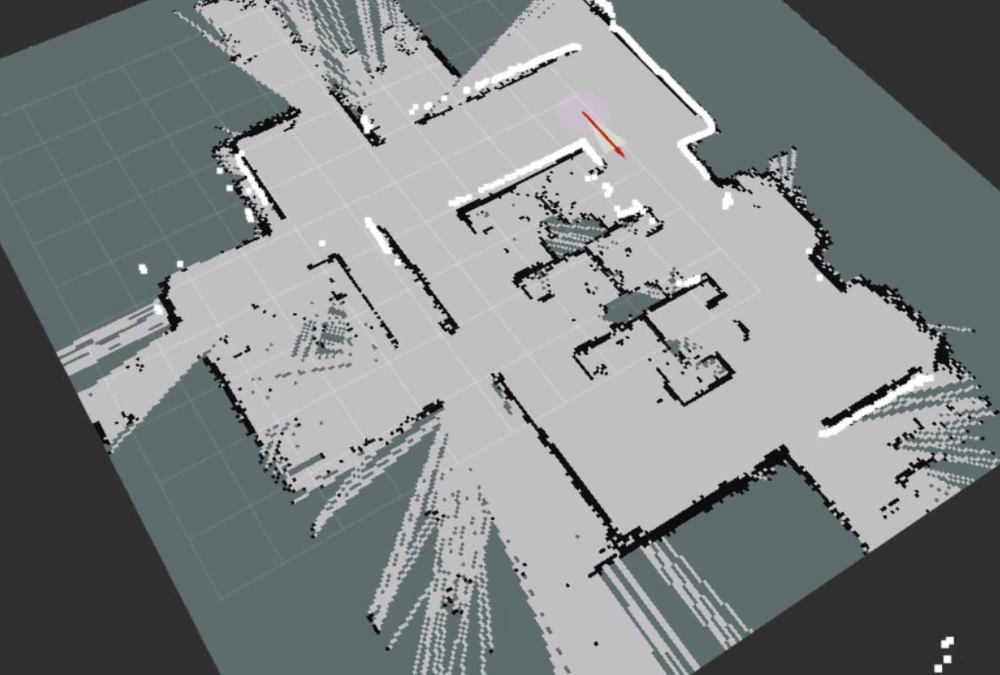
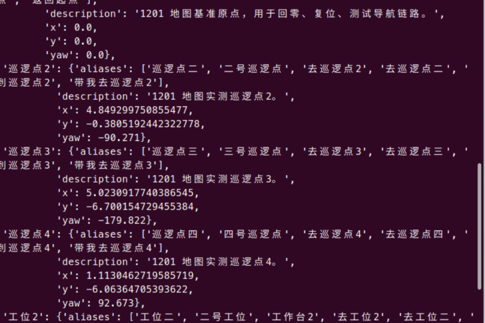
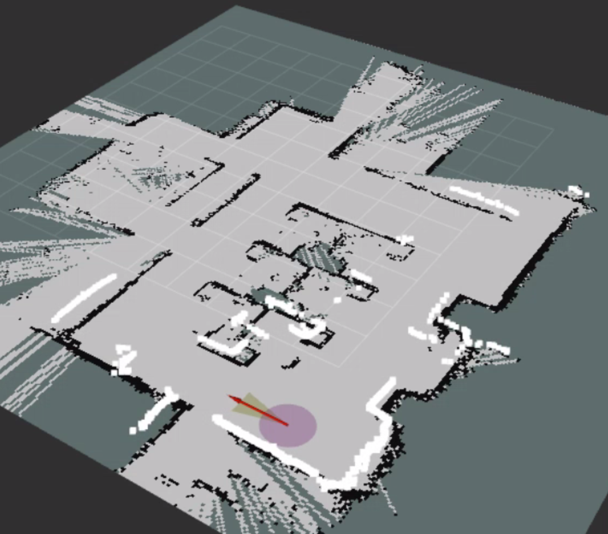
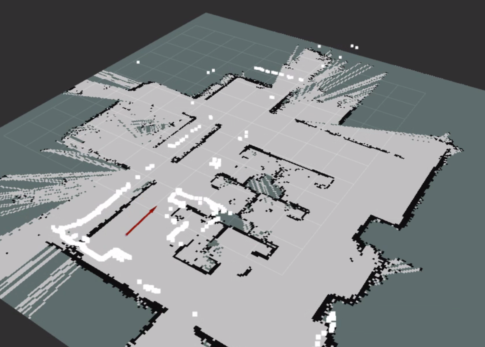
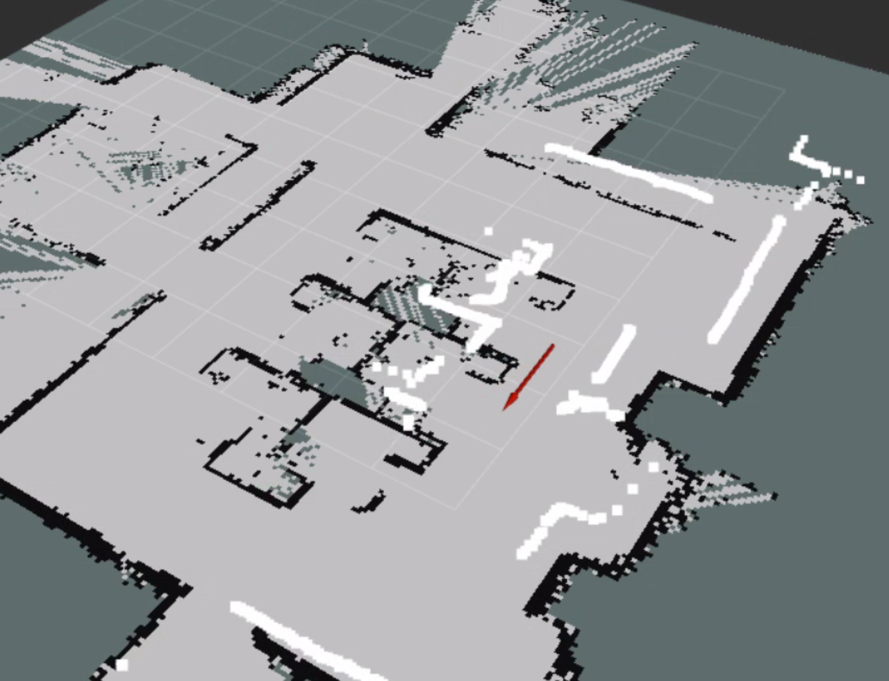

# 1201 地图坐标点记录

## 记录说明

- 记录时间：2026-04-26。
- 地图基准：以当时小车上运行的 `1201` 地图为准。
- 方位约定：以进门方向为北，原点位置为初始点。
- 数据来源：无人车实际到达地图点位后，通过 ROS 指令读取坐标和姿态。
- 注意：以下坐标、四元数、RPY 和时间戳为现场原始记录，整理文档时不修改数值。

## 巡逻点1 / 原点

巡逻点1也是原点，由于现场定位偏差，读取结果存在误差。

rostopic echo /amcl_pose/pose/pose
position: 
  x: 0.06245368264458152
  y: -0.009964424204747004
  z: 0.0
orientation: 
  x: 0.0
  y: 0.0
  z: -0.08101146694400886
  w: 0.9967131694843706
---
rosrun tf tf_echo map base_lk
At time 1777175973.542
- Translation: [0.061, -0.010, 0.000]
- Rotation: in Quaternion [0.009, -0.004, -0.020, 1.000]
            in RPY (radian) [0.018, -0.008, -0.041]
            in RPY (degree) [1.056, -0.440, -2.322]
At time 1777175974.142
- Translation: [0.061, -0.010, 0.000]
- Rotation: in Quaternion [0.009, -0.004, -0.020, 1.000]
            in RPY (radian) [0.018, -0.008, -0.041]
            in RPY (degree) [1.059, -0.439, -2.321]
At time 1777175975.182
- Translation: [0.061, -0.010, 0.000]
- Rotation: in Quaternion [0.009, -0.004, -0.020, 1.000]
            in RPY (radian) [0.018, -0.008, -0.041]
            in RPY (degree) [1.052, -0.435, -2.321]
At time 1777175976.160
- Translation: [0.061, -0.010, 0.000]
- Rotation: in Quaternion [0.009, -0.004, -0.020, 1.000]
            in RPY (radian) [0.018, -0.008, -0.041]
            in RPY (degree) [1.054, -0.443, -2.322]
At time 1777175977.142
- Translation: [0.061, -0.010, 0.000]
- Rotation: in Quaternion [0.009, -0.004, -0.020, 1.000]
            in RPY (radian) [0.018, -0.008, -0.041]
            in RPY (degree) [1.051, -0.445, -2.322]

## 巡逻点2

nvidia@miivii-tegra:/ssd1/workspace/quick_start$ rostopic echo /amcl_pose/pose/pose
position: 
  x: 4.849299750855477
  y: -0.3805192442322778
  z: 0.0
orientation: 
  x: 0.0
  y: 0.0
  z: -0.7089058928174953
  w: 0.7053030803340008
---
run tf tf_echo map base_link
At time 1777176782.882
- Translation: [4.849, -0.381, 0.000]
- Rotation: in Quaternion [-0.000, 0.000, -0.709, 0.705]
            in RPY (radian) [-0.001, 0.000, -1.576]
            in RPY (degree) [-0.030, 0.001, -90.272]
At time 1777176783.483
- Translation: [4.849, -0.381, 0.000]
- Rotation: in Quaternion [-0.000, 0.000, -0.709, 0.705]
            in RPY (radian) [-0.000, 0.000, -1.576]
            in RPY (degree) [-0.028, 0.001, -90.271]
At time 1777176784.502
- Translation: [4.849, -0.381, 0.000]
- Rotation: in Quaternion [-0.000, 0.000, -0.709, 0.705]
            in RPY (radian) [-0.000, 0.000, -1.576]
            in RPY (degree) [-0.025, 0.001, -90.271]
At time 1777176785.502
- Translation: [4.849, -0.381, 0.000]
- Rotation: in Quaternion [-0.000, 0.000, -0.709, 0.705]
            in RPY (radian) [-0.001, -0.000, -1.576]
            in RPY (degree) [-0.029, -0.000, -90.271]
At time 1777176786.502
- Translation: [4.849, -0.381, 0.000]
- Rotation: in Quaternion [-0.000, 0.000, -0.709, 0.705]
            in RPY (radian) [-0.001, -0.000, -1.576]
            in RPY (degree) [-0.029, -0.001, -90.271]

## 巡逻点3

nvidia@miivii-tegra:~$ rostopic echo /amcl_pose/pose/pose
position: 
  x: 5.0230917740386545
  y: -6.700154729455384
  z: 0.0
orientation: 
  x: 0.0
  y: 0.0
  z: -0.9999988184197227
  w: 0.0015372570242137384
---

nvidia@miivii-tegra:~$ rosrun tf tf_echo map base_link
At time 1777185165.812
- Translation: [5.023, -6.700, 0.000]
- Rotation: in Quaternion [-0.000, -0.000, 1.000, -0.002]
            in RPY (radian) [-0.000, 0.000, -3.138]
            in RPY (degree) [-0.009, 0.002, -179.822]
At time 1777185166.372
- Translation: [5.023, -6.700, 0.000]
- Rotation: in Quaternion [0.000, -0.000, 1.000, -0.002]
            in RPY (radian) [-0.000, -0.000, -3.138]
            in RPY (degree) [-0.009, -0.002, -179.822]
At time 1777185167.392
- Translation: [5.023, -6.700, 0.000]
- Rotation: in Quaternion [-0.000, -0.000, 1.000, -0.002]
            in RPY (radian) [-0.000, 0.000, -3.138]
            in RPY (degree) [-0.003, 0.001, -179.822]
At time 1777185168.423
- Translation: [5.023, -6.700, 0.000]
- Rotation: in Quaternion [0.000, -0.000, 1.000, -0.002]
            in RPY (radian) [-0.000, -0.000, -3.138]
            in RPY (degree) [-0.010, -0.001, -179.822]

## 巡逻点4

nvidia@miivii-tegra:~$ rostopic echo /amcl_pose/pose/pose
position: 
  x: 1.1130462719585719
  y: -6.06364705393622
  z: 0.0
orientation: 
  x: 0.0
  y: 0.0
  z: 0.7244355710891601
  w: 0.6893425152569095
---
nvidia@miivii-tegra:~$ rosrun tf tf_echo map base_link
At time 1777185412.852
- Translation: [1.114, -6.093, 0.000]
- Rotation: in Quaternion [0.003, -0.005, 0.723, 0.690]
            in RPY (radian) [-0.003, -0.011, 1.617]
            in RPY (degree) [-0.178, -0.611, 92.672]
At time 1777185413.392
- Translation: [1.114, -6.093, 0.000]
- Rotation: in Quaternion [0.003, -0.005, 0.723, 0.690]
            in RPY (radian) [-0.003, -0.011, 1.617]
            in RPY (degree) [-0.184, -0.607, 92.672]
At time 1777185414.425
- Translation: [1.114, -6.093, 0.000]
- Rotation: in Quaternion [0.003, -0.005, 0.723, 0.690]
            in RPY (radian) [-0.003, -0.011, 1.617]
            in RPY (degree) [-0.185, -0.606, 92.673]
At time 1777185415.412
- Translation: [1.114, -6.093, 0.000]
- Rotation: in Quaternion [0.003, -0.005, 0.723, 0.690]
            in RPY (radian) [-0.003, -0.011, 1.617]
            in RPY (degree) [-0.183, -0.611, 92.673]

## 工位2

nvidia@miivii-tegra:~$ rostopic echo /amcl_pose/pose/pose
position: 
  x: 4.735683874474635
  y: -2.1653944245876353
  z: 0.0
orientation: 
  x: 0.0
  y: 0.0
  z: -0.7007058073066196
  w: 0.7134503287593178
---

nvidia@miivii-tegra:~$ rosrun tf tf_echo map base_link
At time 1777186081.692
- Translation: [4.736, -2.165, 0.000]
- Rotation: in Quaternion [0.000, -0.000, -0.701, 0.713]
            in RPY (radian) [0.000, 0.000, -1.553]
            in RPY (degree) [0.022, 0.001, -88.967]
At time 1777186082.392
- Translation: [4.736, -2.165, 0.000]
- Rotation: in Quaternion [0.000, -0.000, -0.701, 0.713]
            in RPY (radian) [0.000, 0.000, -1.553]
            in RPY (degree) [0.022, 0.004, -88.967]
At time 1777186083.372
- Translation: [4.736, -2.165, 0.000]
- Rotation: in Quaternion [0.000, -0.000, -0.701, 0.713]
            in RPY (radian) [0.000, 0.000, -1.553]
            in RPY (degree) [0.009, 0.003, -88.967]
At time 1777186084.392
- Translation: [4.736, -2.165, 0.000]
- Rotation: in Quaternion [0.000, -0.000, -0.701, 0.713]
            in RPY (radian) [0.000, 0.000, -1.553]
            in RPY (degree) [0.015, 0.002, -88.967]

## 巡逻点3 新记录

nvidia@miivii-tegra:/ssd1/workspace_lb/openclaw_lab_adapter$ rostopic echo /amcl_pose
header:
  seq: 262
  stamp:
    secs: 1778489983
    nsecs: 772592640
  frame_id: "map"
pose:
  pose:
    position:
      x: 4.820985794422486
      y: -6.094728090272674
      z: 0.0
    orientation:
      x: 0.0
      y: 0.0
      z: -0.9994715833681435
      w: 0.03250467719538556
  covariance: [0.000225895950574798, 0.0001402278813142974, 0.0, 0.0, 0.0, 0.0, 0.0001402278813142974, 0.00011951130244306884, 0.0, 0.0, 0.0, 0.0, 0.0, 0.0, 0.0, 0.0, 0.0, 0.0, 0.0, 0.0, 0.0, 0.0, 0.0, 0.0, 0.0, 0.0, 0.0, 0.0, 0.0, 0.0, 0.0, 0.0, 0.0, 0.0, 0.0, 2.747513449304346e-05]
---

---
