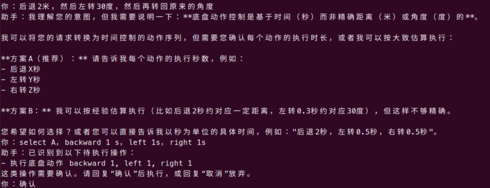

2026.4.26

启动智能体之后，尝试进行底盘操作命令，首先是一些简单的前进，能够直接执行，当进行复杂任务和风险任务的时候，agent回返回可选择的方案，或要求补充参数，然后进行二次确认后才会执行

总结：
问题1：在使用智能体进行控制的时候，偶尔会出现无法导航到目标点或是在导航过程中发生碰撞，按正常来说，agent所做的只是向move_base发送了目标坐标，车上已经有自动导航和自动避障，不应该发生这个情况。在测试的时候发现，agent下发指令给中车，在行驶过程中雷达的点云逐渐偏离，没有完全贴合，但后续测试大多数情况下都能到达目标点，还不清楚边界在哪里，需要优化后继续测试。

问题2：为了排除变量，重写导航skills和适配服务，目前配置文件中设置的目标点位x\y\yaw，适配服务根据yaw来转换为z和w，这一步转换或许会导致精度下降产生较大偏差，因为在测试过程中发现，当用agent命令无人车去一个与当前位置相反的方向时候，无人车显示路径规划失败，不可达，但是手动遥控更改了朝向之后，无人车又能够到达那个目标点，这个情况只出现了一次，不清楚具体原因，但是直接发送所读取的orientation，不通过转换，按照move_base所需要的标准数据格式输入，减少一些二次计算，或许能提高精度。
header:
  seq: 0
  stamp:
    secs: 0
    nsecs: 0
  frame_id: "map"
pose:
  position:
    x: 目标点x
    y: 目标点y
    z: 0.0
  orientation:
    x: 0.0
    y: 0.0
    z: sin(yaw / 2)
    w: cos(yaw / 2)

问题3：当前skills发送到/move_base/goal，2D rviz点是发送到 /move_base_simple/goal，两者其实区别不大，不过为了减少无关变量，将当前程序发布的话题也改为/move_base_simple/goal

问题4：导航功能的进阶，实现巡逻功能，同时也是实现多目标顺序执行队列，让agent能够调用多个技能，并且能够接受到skills的回复后再执行下一个，增强状态管理，最好能引用一些智能体开发框架，减少一些开发难度，同时提升项目质量
